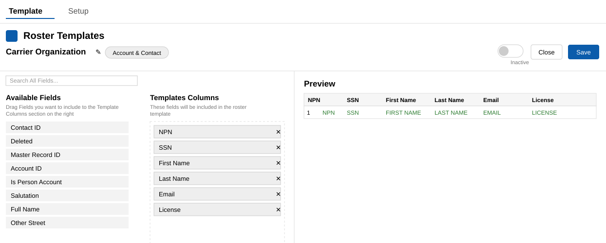

# Overview

If you work with one or more carriers in a [delegated relationship](./02-about-delegated-authority), use Clearpath to generate [rosters](./03-about-rosters) of producer data and share them with carriers.

Each carrier may require a different roster format for submission. A roster-template builder in Clearpath lets you format rosters according to each carrier's specifications, including:

- How columns are named and formatted
- How objects are linked
- How fields are included and sorted 
 
Then you can export rosters as a CSV files and share them with carriers.

Clearpath also helps you maintain your roster lists. Add, remove, or update a producer's appointment with a specific carrier through a guided user interface:

