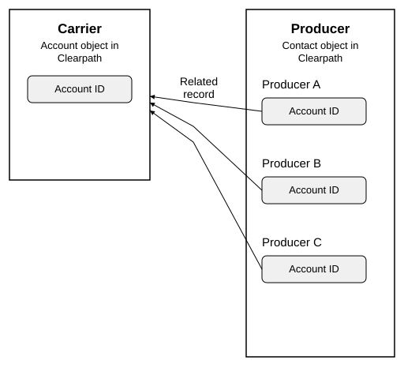
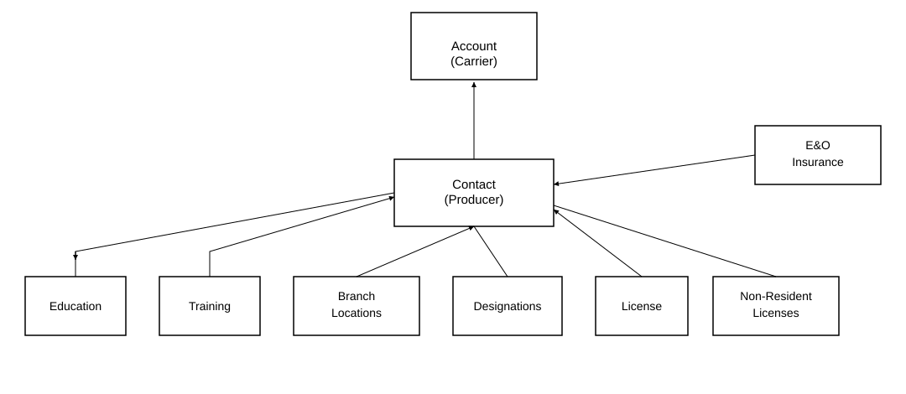
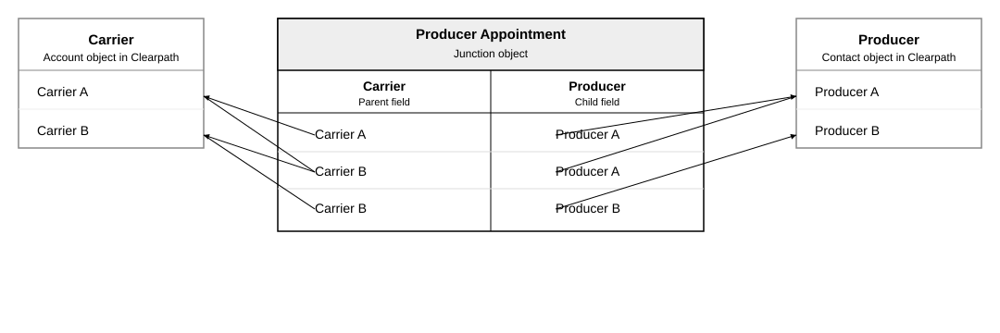
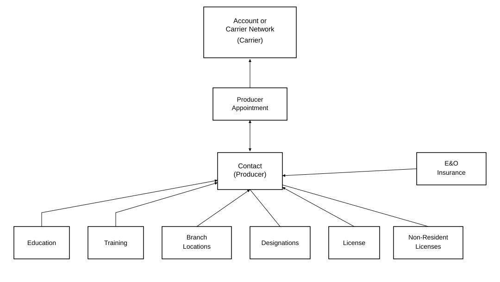

# Choose a relationship type

First, [choose objects to store carriers and producers](./create-a-template).

Fill out the following field:

| Field                    | What to select                                                                         |
| ------------------------ | -------------------------------------------------------------------------------------- |
| Select Relationship Type | Select a relationship type to determine how carrier and producer objects are associated. |

Choose between two relationship types:

- [About a related record](#about-a-related-record)
- [About a junction object](#about-a-junction-object)

## About a related record

A related record is based on the concept of a one-to-many relationship. This means you can reference contacts that are direct children of the account, like accessing all producers under a carrier.

In the following example, the **Carrier** table defines the type of object you're using to group producers by, like if you want to run a roster for a program and you plan to use the **Account** object.

The **Producer** table defines the type of object you're using for producers.

The reference field (**Account ID**) identifies which carrier's contacts you want to use, like pulling all contacts that are children of a carrier.

Following is another example.

To create a template using a related record relationship type, see [Choose a relationship type](./choose-a-relationship-type).

## About a junction object

Based on the concept of a many-to-many relationship, a junction object makes it possible to link multiple rows in one table to multiple rows in another table. This selection will be most commonly used to generate rosters.

A common use case is to reference producers connected via an indirect grouping who aren't direct children of the carrier, like an object that relates the producer to the carrier object, such as the **Producer Appointment** object. This makes it possible to access producers linked to a specific program.

In this example, producer A is associated with multiple carriers. Producer B is associated with only one carrier.

In this example, **Producer Appointment** is the junction object.

To create a template using a junction object relationship type, see [Choose a relationship type](./choose-a-relationship-type).
